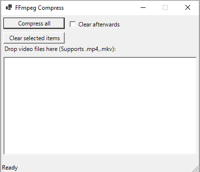

# Compressor

A Powershell script written with a GUI to compress video files. This is done by using FFmpeg.

 It is currently hard-coded to output a video file around a size of 8MB.

## Getting Started

### Prerequisites

- Powershell 7
    It is recommended to use PowerShell 7.0.X
    Powershell 7.0.X can be downloaded at https://github.com/PowerShell/powershell/releases

    NOTE:
    - The script was formally tested using **PowerShell 7.0.3**.
    - The script will **definitely** not work with PowerShell 5 and older. Powershell 6 may work but has not been tested.

- FFmpeg  

    FFmpeg builds for Windows can be downloaded at https://github.com/BtbN/FFmpeg-Builds/releases

    FFmpeg will need to be set up in PATH. Instructions can be found here: https://video.stackexchange.com/questions/20495/how-do-i-set-up-and-use-ffmpeg-in-windows

## Execution

Enable execution of PowerShell scripts (Replace `CurrentUser` with your username):

```powershell
PS> Set-ExecutionPolicy Unrestricted -Scope CurrentUser
```

## Usage

1. Run compressForm.ps1 to open the GUI

```powershell
.\compressForm.ps1
```

The following window should appear:



2. Drag any video files you wish to compress into the list box. Only the shown supported video extensions are currently supported. More video extensions will be added in future releases.

    Non-supported files will be rejected.

3. Once all the target video files have been dragged in, press `Compress all` to begin compressing all of the listed video files. The compression process will be logged in the Powershell console the GUI is running from.

    The resulting compressed video file will be found in the same directory as the source file with an appended `_compressed` added to the name. The original video file is **not modified**.

Example:
```
Source file: C:\Videos\VideoClip.mp4
Result file: C:\Videos\VideoClip_compressed.mp4
```

## Known Issues

### Maximum Path Length Limitation

On Windows 10, Version 1607 and older, there is a MAX_PATH limitation of 260 characters.

The script currently does not take this into account. If the MAX_PATH limit is active, it is highly likely that the script will fail when dealing with paths that approach the character limit.

### Output file's file size is greater than the specified threshold

For most videos, the output compressed file will be below the specified filesize threhold. However, there are some cases where this is not the case. I am still currently investigating a better formula to accurately calculate the required average bitrate.
